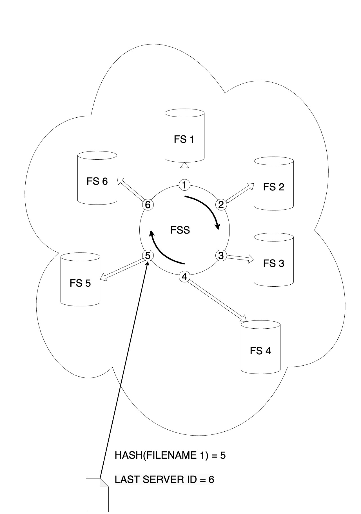
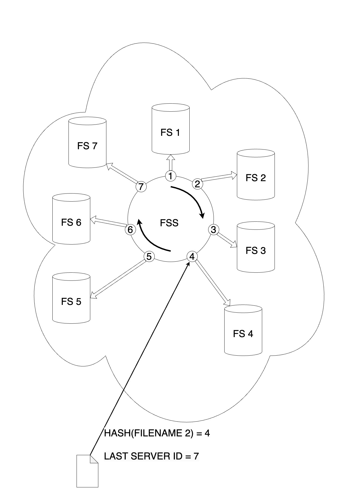
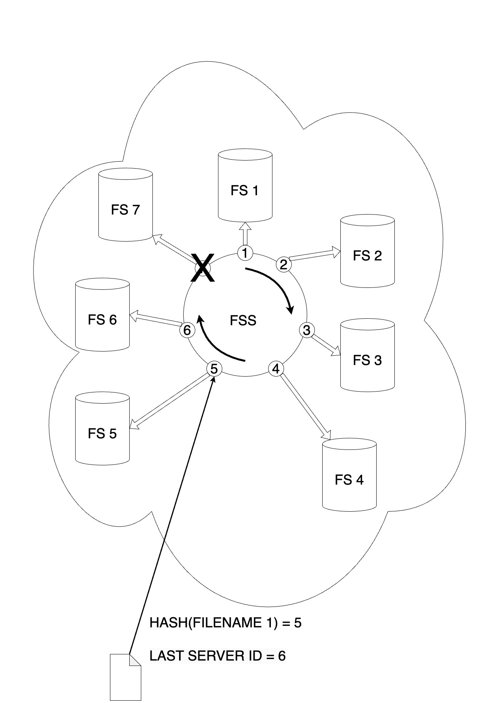

# File Storage Service (FSS)
File Storage Service (FSS) is a distributed file storage system designed to provide efficient and reliable file storage and retrieval through RESTful APIs. FSS ensures seamless handling of large files by breaking them into approximately equal-sized fragments and distributing these fragments across multiple file servers (FS).

## Overview
FSS operates with the following components:

RESTful Server (Server A): This server receives incoming files via REST requests. Upon receiving a file, it calculates the hash of the file's name and selects the first file storage (FS) server from an ordered list of available FS servers.

The FS are dynamically added to the system but cannot be removed. FSS ensures a uniform distribution of file fragments across these servers.

## Example
Saving a file:  
I. The system records the start, calculates the hash of its name, takes the remainder after division by the number of servers.  
II. Distribution of limited-size fragments begins in a circular fashion from a specific server. This ensures an even distribution of data across active file servers.  
III. For optimization, fragments are simultaneously distributed to all file servers. After receiving successful responses from all file servers, the next set of fragments is distributed. This process continues until all file data is distributed.

Pic. 1

In Pic 1, the schema illustrates the process of saving a file named filename1. When the system is accessed, a complete ordered list of active servers, numbering 6, is retrieved from the database. The remainder after dividing the hash of the file name by the number of servers is 5. Saving begins from this server in a circular manner.

Let file filename 1 be divided into 15 fragments by the system. For the first distribution, fragments 1-6 are sent to servers 5-6-1-2-3-4. For the second distribution, fragments 7-12 are sent to servers 5-6-1-2-3-4. For the third distribution, fragments 13-15 are sent to servers 5-6-1.

Pic. 2

In Pic 2, the schema illustrates the process of saving a file named filename2 with an additional server added to the system (FSS adds servers with monotonically increasing identifiers). The remainder after dividing the hash of the file name by the number of servers is 4.

Let filename2 be divided into 5 fragments by the system. For the first distribution, fragments 1-5 are sent to servers 4-5-6-7-1.

Pic 3  
In Pic 3, the schema illustrates the process of retrieving the file named filename1. The file's metadata indicates that the file was divided into 15 fragments when there were 6 active servers. The service initiates inquiries to the file servers, assembles the file fragments, and returns the final result.

## Installation
To set up and run FSS locally, follow these steps:

### Clone the repository:
```shell
git clone https://github.com/Tsapen/fss.git
cd fss
```
### Check tests works correctly:
```shell
make test
```
### Run FSS:
```shell
make run
```

## HTTP Client
The FSS also provides an HTTP client for interacting with the API. You can use the client to make requests and receive responses programmatically.

### Example:
```shell
go get github.com/Tsapen/fss/pkg/client
```
